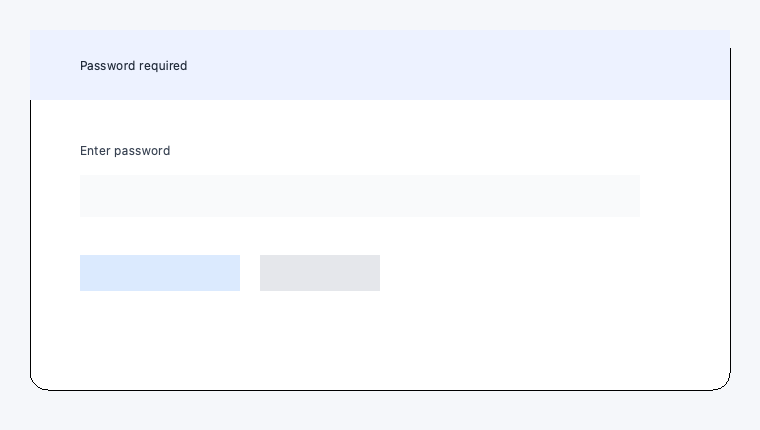

# Folimeld

[English](README_en.md) | [日本語](README.md)


Folimeld is a desktop application for visually rearranging, rotating, inserting, and deleting PDF pages. It supports Windows, macOS, Ubuntu, and Debian, and processes files locally without sending them to external services.


## Features

- Rearrange PDF pages using thumbnail previews
- Select, move, rotate, or delete multiple pages at once
- Insert another PDF or a blank page of the same size
- Edit the PDF version, page layout, and binding direction
- Set or remove a password required to open a PDF
- Available in Japanese, English, German, Spanish, French, Korean, Portuguese, and Chinese
- Runs on Windows (both Intel/AMD (x64) and ARM (arm64) editions), macOS, Ubuntu, and Debian

## Downloads

Download release packages from [GitHub Releases](https://github.com/tyamada/Folimeld/releases).

| OS | Package formats |
| --- | --- |
| Windows 10 / 11 (Intel/AMD (x64) / ARM (arm64)) | EXE / MSIX (Microsoft Store release in preparation) |
| macOS | `.app` (App Store release in preparation) |
| Ubuntu | `.deb` / `.snap` / standalone executable (see each release for supported versions) |
| Debian 13 | `.deb` (amd64 / arm64; basic functionality verified on WSL2) |

> [!NOTE]
> Packages for some operating systems may not be available in every release.

### Direct downloads for Ubuntu / Debian

Version **0.3.3 / x86_64 (amd64)**:

- [Download the x86_64 deb package](releases/ubuntu/folimeld_0.3.3_amd64.deb?raw=true) (Ubuntu 22.04 or later / Debian 13)
- [Download the x86_64 Snap package](releases/ubuntu/folimeld_0.3.3_amd64.snap?raw=true) (requires snapd)
- [SHA-256 checksums](releases/ubuntu/folimeld_0.3.3_SHA256SUMS.txt?raw=true)
- [Build source snapshots and artifact records](releases/ubuntu/source/0.3.3-amd64/)

Run the installation command for your chosen package from the download folder.

```bash
# deb package
sudo apt install ./folimeld_0.3.3_amd64.deb

# Snap package
sudo snap install --dangerous ./folimeld_0.3.3_amd64.snap
```

Version **0.3.3 / arm64 (AArch64)**:

- [Download the arm64 deb package](releases/ubuntu/folimeld_0.3.3_arm64.deb?raw=true) (Ubuntu 22.04 or later / Debian 13)
- [Download the arm64 Snap package](releases/ubuntu/folimeld_0.3.3_arm64.snap?raw=true) (requires snapd)
- [SHA-256 checksums](releases/ubuntu/folimeld_0.3.3_SHA256SUMS.txt?raw=true)
- [Build source snapshots and artifact records](releases/ubuntu/source/0.3.3-arm64/)

```bash
# arm64 deb package
sudo apt install ./folimeld_0.3.3_arm64.deb

# arm64 Snap package
sudo snap install --dangerous ./folimeld_0.3.3_arm64.snap
```

Debian 13 uses the same deb package as Ubuntu. If a minimal installation displays `Fontconfig error: Cannot load default config file`, run `sudo apt install fontconfig-config`. PDF display, page movement, rotation, saving, and reopening have been verified on Debian 13.6 amd64 (WSL2 / WSLg, X11). See the [Debian verification record](docs/debian-wsl-verification.md) (in Japanese) for details. Installation of the deb package and startup with a PDF have also been verified on arm64 (WSL2).

## Basic usage

Open **Help → User guide** or press F1 to view basic operations, settings, and keyboard shortcuts. You can keep the guide open while working on a PDF.

1. Launch Folimeld and select a PDF using **File → Open**.
2. Click a page to select it. Use Ctrl or Shift to select multiple pages.
3. Edit pages using the toolbar, menus, or drag and drop.
4. Export the PDF using **Save** or **Save As**.

Opening a password-protected PDF displays a prompt for the password required to open it.



### Document settings

The **Details** tab in **Document Properties** lets you change the PDF version and page layout. Selecting `TwoPageLeft` or `TwoPageRight` raises the PDF version to 1.5 if necessary.

### Saved preferences

Under **Settings → Image Size**, choose a thumbnail size of 144, 288, or 432 px for the longer edge (default: 288 px). Changes take effect immediately.

The display language, image size, and last opened folder are saved on your device. PDFs are processed locally. Support purchases in the Windows MSIX edition use Microsoft Store to retrieve product information, check purchase status, and process payments. PDFs are never sent to the Store.

In the Windows MSIX edition, **Help → Support Development…** lets you make a one-time purchase with a supporter icon (once the product is published in the Store). Purchasing adds a supporter icon to the Help menu. PDF editing features are the same whether or not you make a purchase. For developer setup instructions, see [Windows support purchases](docs/windows-store-purchases.md) (in Japanese).

## Development and contributions

See [DEVELOPMENT_en.md](DEVELOPMENT_en.md) for instructions on running from source, testing, and building packages for each operating system. Report bugs and suggest improvements through [Issues](https://github.com/tyamada/Folimeld/issues).

Release history is available in [CHANGELOG_en.md](CHANGELOG_en.md).

## License

Folimeld is released under the [GNU Affero General Public License v3.0](LICENSE).

Third-party libraries, including PySide6 and PyMuPDF, are covered by their respective licenses.

The full license texts and third-party notices are available under **Help → Licenses**.
See [Licensing and distribution](docs/license-distribution.md) (in Japanese) for distribution requirements.
